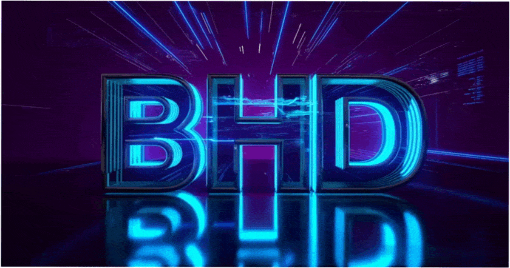

---

  
  
  
  

---

## 🚀 About Us

Sliz® is a team of top-notch developers and crypto enthusiasts building **ultra-fast and secure blockchain solutions**.  
We don’t just code — we’re shaping the future of **DeFi** and **Web3**!

---

## 🌐 Our Focus Areas

- **⚡ Development of blockchain protocols** with maximum transaction processing speed
- **📈 Hyperscaling** infrastructure for cryptocurrencies and DApps
- **🔒 Security and smart contract audits** at the highest level
- **🪙 Innovative tokenomics and DeFi solutions**

---

## 🔗 Contacts & Resources

- Website: [B-HD® Website](https://bhd.pp.ua)  
- Telegram: [Official Telegram Channel](https://t.me/BHDtm)
- GitHub: [B-HD®](https://github.com/B-HDtm)  
- Email: markd.voznyuk@gmail.com

---

## 🎯 Our Mission

To create reliable and scalable blockchain solutions that will change the game in the world of cryptocurrencies.  
We are the driving force behind new financial trends and technologies of the future!  
We also develop useful projects for traders, crypto creators, and more!

---

## 🤝 Join Us!

Want to be part of the revolution? Fill out the [form](https://forms.gle/6vG9Ue16EF7NbMFJA) and join the hyper development of the future!

---

*Powered by B-HD®* ❤️
